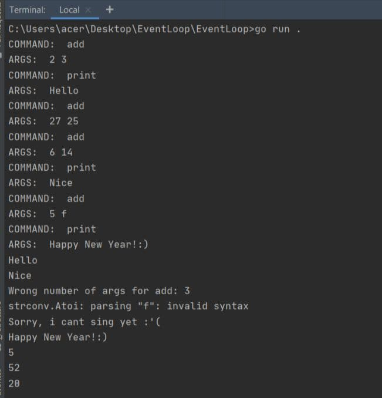

##### Лабораторна робота №4

# Цикл подій (event loop)

**Мета:** Отримання навичок імплементації систем на основі циклу подій

Мовою Go реалізовано інтерпретатор команд, який виконує інструкції у циклі подій.
Інтерпретатор читає команди з вхідного файла.

У даній роботі реалізовано обробку інструкцій:

1. print <arg>
   Дана інструкція як результат виводить вказаний аргумент на екран.

2. add <arg1> <arg2>
   Інструкція обчислює суму arg1 + arg2 та викликає print з даною сумою.

   

Приклад виконання програми:

